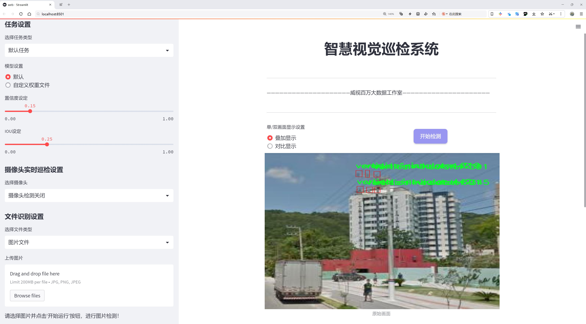
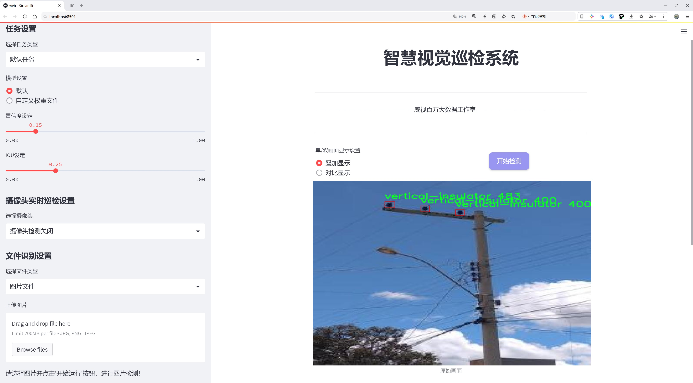
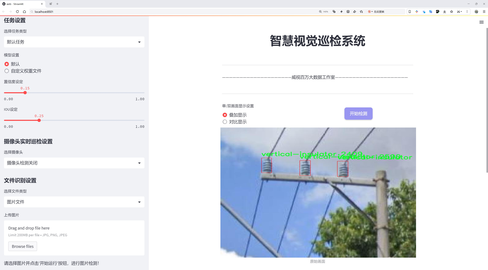
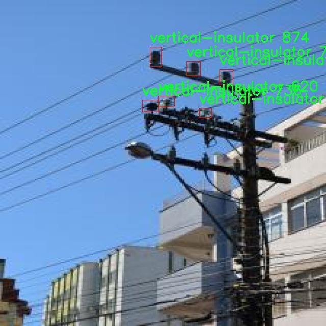
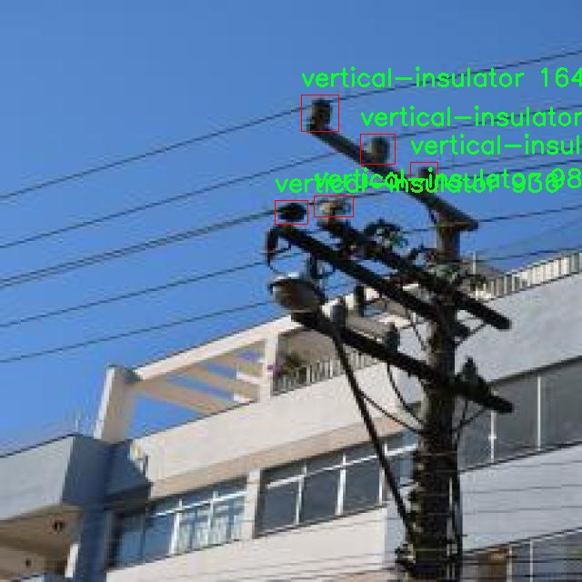
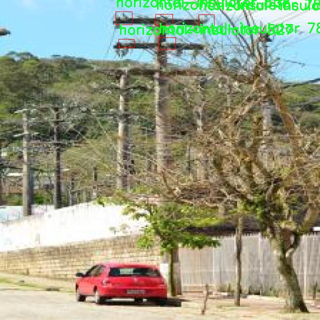
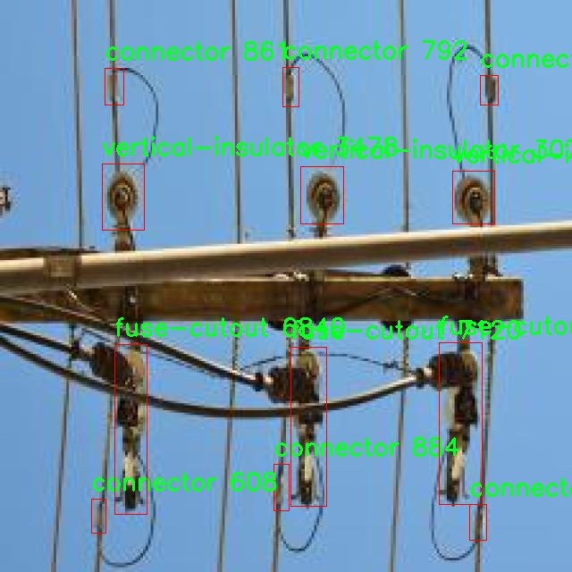
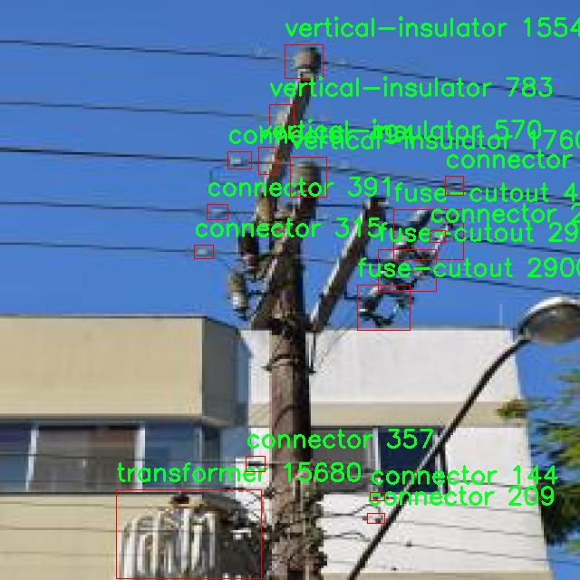

# 电线杆上电气组件检测检测系统源码分享
 # [一条龙教学YOLOV8标注好的数据集一键训练_70+全套改进创新点发刊_Web前端展示]

### 1.研究背景与意义

项目参考[AAAI Association for the Advancement of Artificial Intelligence](https://gitee.com/qunmasj/projects)

项目来源[AACV Association for the Advancement of Computer Vision](https://kdocs.cn/l/cszuIiCKVNis)

研究背景与意义

随着城市化进程的加快，电力基础设施的建设与维护显得尤为重要。电线杆作为电力传输系统的关键组成部分，其上所承载的电气组件的安全性和可靠性直接影响到电力供应的稳定性和安全性。传统的电气组件检测方法往往依赖人工巡检，效率低下且容易受到人为因素的影响，难以保证检测的全面性和准确性。因此，开发一种高效、自动化的电线杆上电气组件检测系统显得尤为迫切。

近年来，深度学习技术的迅猛发展为目标检测领域带来了新的机遇。YOLO（You Only Look Once）系列模型以其快速、准确的特性在目标检测任务中得到了广泛应用。YOLOv8作为该系列的最新版本，具备了更强的特征提取能力和更高的检测精度。然而，针对电线杆上电气组件的检测任务，YOLOv8仍然存在一定的局限性，如对小目标的检测能力不足、背景复杂时的误检率较高等。因此，基于YOLOv8的改进研究具有重要的理论和实际意义。

本研究旨在构建一个基于改进YOLOv8的电线杆上电气组件检测系统，以实现对电线杆上六类电气组件（连接器、熔断器、水平绝缘子、架空开关、变压器和垂直绝缘子）的高效检测。为此，我们将利用包含2284张图像的数据集，涵盖了多种电气组件的不同场景和角度，确保模型在多样化环境下的适应性和鲁棒性。通过对YOLOv8模型的改进，如引入更为先进的特征融合技术、优化损失函数、增强数据增强策略等，我们期望能够显著提升模型在电气组件检测任务中的性能。

该研究不仅具有重要的学术价值，还具备广泛的应用前景。通过实现对电线杆上电气组件的自动化检测，可以大幅度提高电力设施的巡检效率，降低人工成本，减少人为失误的风险。同时，及时发现并处理潜在的电气故障，有助于提升电力系统的安全性和可靠性，保障城市电力供应的稳定。此外，该检测系统的成功应用还可以为其他领域的目标检测提供借鉴，推动智能监测技术的进一步发展。

综上所述，基于改进YOLOv8的电线杆上电气组件检测系统的研究，不仅能够填补当前电力设施检测领域的技术空白，还将为电力行业的智能化转型提供有力支持，具有重要的理论意义和实际应用价值。

### 2.图片演示







##### 注意：由于此博客编辑较早，上面“2.图片演示”和“3.视频演示”展示的系统图片或者视频可能为老版本，新版本在老版本的基础上升级如下：（实际效果以升级的新版本为准）

  （1）适配了YOLOV8的“目标检测”模型和“实例分割”模型，通过加载相应的权重（.pt）文件即可自适应加载模型。

  （2）支持“图片识别”、“视频识别”、“摄像头实时识别”三种识别模式。

  （3）支持“图片识别”、“视频识别”、“摄像头实时识别”三种识别结果保存导出，解决手动导出（容易卡顿出现爆内存）存在的问题，识别完自动保存结果并导出到tempDir中。

  （4）支持Web前端系统中的标题、背景图等自定义修改，后面提供修改教程。

  另外本项目提供训练的数据集和训练教程,暂不提供权重文件（best.pt）,需要您按照教程进行训练后实现图片演示和Web前端界面演示的效果。

### 3.视频演示

[3.1 视频演示](https://www.bilibili.com/video/BV1yhsheJEmM/)

### 4.数据集信息展示

##### 4.1 本项目数据集详细数据（类别数＆类别名）

nc: 6
names: ['connector', 'fuse-cutout', 'horizontal-insulator', 'overhead-switch', 'transformer', 'vertical-insulator']


##### 4.2 本项目数据集信息介绍

数据集信息展示

在现代电力系统的维护与管理中，电线杆上电气组件的准确检测与识别至关重要。为此，研究团队构建了一个名为“robocelesc”的数据集，旨在为改进YOLOv8模型提供丰富的训练数据，以提升电气组件的检测精度和效率。该数据集专注于电线杆上常见的电气组件，涵盖了六个主要类别，分别是连接器（connector）、熔断器切断器（fuse-cutout）、水平绝缘子（horizontal-insulator）、架空开关（overhead-switch）、变压器（transformer）和垂直绝缘子（vertical-insulator）。这些组件在电力传输和配电系统中发挥着重要作用，因此，准确识别和定位它们对于确保电力系统的安全与稳定至关重要。

“robocelesc”数据集的构建过程包括从多个电力设施现场收集图像，确保数据的多样性和代表性。数据集中包含的图像来源于不同的地理位置和气候条件，以便模型能够在各种环境下保持良好的性能。每个类别的样本数量经过精心设计，以确保模型在训练过程中能够充分学习到各个类别的特征。数据集中的图像不仅涵盖了不同的视角和距离，还包括了不同的光照条件和背景环境，这为模型的泛化能力提供了良好的基础。

在标注方面，数据集采用了高精度的手动标注方法，确保每个电气组件的边界框和类别标签的准确性。标注团队由经验丰富的电力工程师和计算机视觉专家组成，他们在标注过程中结合了专业知识和计算机视觉技术，确保数据集的高质量。这种高质量的标注不仅提高了模型的训练效果，也为后续的模型评估和应用提供了可靠的数据基础。

为了进一步增强数据集的实用性，研究团队还对“robocelesc”进行了数据增强处理，包括旋转、缩放、翻转和颜色调整等。这些增强技术不仅增加了数据集的样本数量，还帮助模型在面对不同场景和条件时具备更强的鲁棒性。通过这些措施，数据集的多样性得到了显著提升，使得模型在实际应用中能够更好地适应各种复杂的环境。

在训练过程中，改进后的YOLOv8模型将利用“robocelesc”数据集进行深度学习，学习各类电气组件的特征表示。通过不断迭代和优化，模型将能够实现高效的目标检测，准确识别电线杆上的各类电气组件，并提供实时的检测结果。这一过程不仅提高了电力设施的监测效率，也为电力系统的安全运行提供了有力保障。

总之，“robocelesc”数据集的构建与应用为电线杆上电气组件的检测提供了坚实的基础。通过高质量的标注、多样化的样本和有效的数据增强，研究团队希望能够推动电力系统智能化的发展，提升电气组件检测的自动化水平，最终实现更安全、更高效的电力管理。











### 5.全套项目环境部署视频教程（零基础手把手教学）

[5.1 环境部署教程链接（零基础手把手教学）](https://www.ixigua.com/7404473917358506534?logTag=c807d0cbc21c0ef59de5)


[5.2 安装Python虚拟环境创建和依赖库安装视频教程链接（零基础手把手教学）](https://www.ixigua.com/7404474678003106304?logTag=1f1041108cd1f708b01a)

### 6.手把手YOLOV8训练视频教程（零基础小白有手就能学会）

[6.1 手把手YOLOV8训练视频教程（零基础小白有手就能学会）](https://www.ixigua.com/7404477157818401292?logTag=d31a2dfd1983c9668658)

### 7.70+种全套YOLOV8创新点代码加载调参视频教程（一键加载写好的改进模型的配置文件）

[7.1 70+种全套YOLOV8创新点代码加载调参视频教程（一键加载写好的改进模型的配置文件）](https://www.ixigua.com/7404478314661806627?logTag=29066f8288e3f4eea3a4)

### 8.70+种全套YOLOV8创新点原理讲解（非科班也可以轻松写刊发刊，V10版本正在科研待更新）

由于篇幅限制，每个创新点的具体原理讲解就不一一展开，具体见下列网址中的创新点对应子项目的技术原理博客网址【Blog】：


[8.1 70+种全套YOLOV8创新点原理讲解链接](https://gitee.com/qunmasj/good)

### 9.系统功能展示（检测对象为举例，实际内容以本项目数据集为准）

图9.1.系统支持检测结果表格显示

  图9.2.系统支持置信度和IOU阈值手动调节

  图9.3.系统支持自定义加载权重文件best.pt(需要你通过步骤5中训练获得)

  图9.4.系统支持摄像头实时识别

  图9.5.系统支持图片识别

  图9.6.系统支持视频识别

  图9.7.系统支持识别结果文件自动保存

  图9.8.系统支持Excel导出检测结果数据


### 10.原始YOLOV8算法原理

原始YOLOv8算法原理

YOLOv8作为YOLO系列的最新版本，承载着前代模型的优势，并在此基础上进行了深度的创新与改进。其设计理念是实现更高效的目标检测，同时兼顾模型的灵活性和准确性。YOLOv8的网络结构主要由三部分组成：Backbone、Neck和Head，每一部分都经过精心设计，以确保模型在特征提取和目标检测方面的卓越表现。

在Backbone部分，YOLOv8采用了CSPDarknet结构，这是一种通过交叉阶段部分（Cross Stage Partial）设计来优化梯度流动的网络架构。与YOLOv5的C3模块相比，YOLOv8引入了C2f模块，这一模块的设计灵感来源于YOLOv7的ELAN思想。C2f模块将输入特征图分为两个分支，每个分支通过卷积层进行特征提取，形成更高维度的特征图。C2f模块的创新之处在于其能够有效地缓解深层网络中的梯度消失问题，同时增强浅层特征的重用能力。这种设计不仅提升了特征提取的效率，还在保持模型轻量化的同时，确保了检测精度的提升。

在特征提取过程中，YOLOv8还引入了快速空间金字塔池化（SPPF）结构，以提取不同尺度的特征。这一结构的优势在于能够有效减少模型的参数量和计算量，从而提高特征提取的速度和效率。通过多层次的特征提取，YOLOv8能够捕捉到目标物体的丰富信息，为后续的目标检测奠定了坚实的基础。

接下来是Neck部分，YOLOv8采用了特征金字塔网络（FPN）与路径聚合网络（PAN）的结合，形成了一个强大的特征融合模块。该模块的设计旨在充分融合不同层次的特征信息，以便更好地捕捉目标物体的多尺度特征。通过自下而上的高层特征与中层、浅层特征的融合，YOLOv8能够有效提升检测的准确性。特别是在处理小目标时，Neck部分的设计确保了高层语义信息与细节信息的有效结合，从而提高了小目标的检测能力。

YOLOv8的Head部分则是其创新的另一体现。该部分采用了解耦头（Decoupled Head）结构，将目标分类和边框回归分开处理。这一设计使得模型在进行目标检测时，能够更加专注于每个任务的特定需求，从而提高了整体的检测性能。此外，YOLOv8抛弃了传统的Anchor-Based方法，转而采用Anchor-Free的检测方式。这一转变使得模型在处理不同尺寸和比例的目标时，能够更加灵活，减少了对预设Anchor的依赖，从而提升了模型的泛化能力。

在损失函数的设计上，YOLOv8引入了VFLLoss和DFLLoss+CIoULoss的组合，旨在更好地处理样本不平衡问题。通过优化损失函数，YOLOv8能够在训练过程中更有效地聚焦于难以分类的样本，从而提升模型的学习效率和检测精度。

值得一提的是，YOLOv8在数据预处理方面也进行了创新。通过采用马赛克增强、混合增强、空间扰动和颜色扰动等多种数据增强手段，YOLOv8能够有效提升模型的鲁棒性和适应性。这些增强手段不仅丰富了训练样本的多样性，还帮助模型更好地适应不同的场景和条件。

综上所述，YOLOv8通过对Backbone、Neck和Head部分的深度优化，结合先进的特征提取和目标检测技术，展现了其在目标检测领域的强大能力。无论是在检测速度、准确性，还是在处理复杂场景和小目标方面，YOLOv8都表现出了优异的性能，成为了当前目标检测任务中的一款重要工具。随着YOLOv8的不断发展与应用，未来在计算机视觉领域的更多创新与突破也将指日可待。


### 11.项目核心源码讲解（再也不用担心看不懂代码逻辑）

#### 11.1 70+种YOLOv8算法改进源码大全和调试加载训练教程（非必要）\ultralytics\utils\callbacks\neptune.py

以下是对代码的核心部分进行提炼和详细注释的结果：

```python
# 导入必要的库和模块
from ultralytics.utils import LOGGER, SETTINGS, TESTS_RUNNING

# 尝试导入 NeptuneAI 相关模块并进行初始化
try:
    assert not TESTS_RUNNING  # 确保不在测试模式下
    assert SETTINGS['neptune'] is True  # 确保启用了 Neptune 集成
    import neptune
    from neptune.types import File

    assert hasattr(neptune, '__version__')  # 确保 Neptune 有版本属性

    run = None  # 初始化 NeptuneAI 实验记录实例

except (ImportError, AssertionError):
    neptune = None  # 如果导入失败，neptune 设为 None


def _log_scalars(scalars, step=0):
    """将标量数据记录到 NeptuneAI 实验记录器中。"""
    if run:  # 如果 run 已初始化
        for k, v in scalars.items():  # 遍历标量字典
            run[k].append(value=v, step=step)  # 记录每个标量值


def _log_images(imgs_dict, group=''):
    """将图像记录到 NeptuneAI 实验记录器中。"""
    if run:  # 如果 run 已初始化
        for k, v in imgs_dict.items():  # 遍历图像字典
            run[f'{group}/{k}'].upload(File(v))  # 上传每个图像文件


def on_pretrain_routine_start(trainer):
    """在训练例程开始前调用的回调函数。"""
    try:
        global run
        # 初始化 Neptune 运行
        run = neptune.init_run(project=trainer.args.project or 'YOLOv8', name=trainer.args.name, tags=['YOLOv8'])
        # 记录超参数配置
        run['Configuration/Hyperparameters'] = {k: '' if v is None else v for k, v in vars(trainer.args).items()}
    except Exception as e:
        LOGGER.warning(f'WARNING ⚠️ NeptuneAI 安装但未正确初始化，未记录此运行. {e}')


def on_train_epoch_end(trainer):
    """每个训练周期结束时调用的回调函数。"""
    # 记录训练损失和学习率
    _log_scalars(trainer.label_loss_items(trainer.tloss, prefix='train'), trainer.epoch + 1)
    _log_scalars(trainer.lr, trainer.epoch + 1)
    if trainer.epoch == 1:  # 如果是第一个周期
        # 记录训练批次的图像
        _log_images({f.stem: str(f) for f in trainer.save_dir.glob('train_batch*.jpg')}, 'Mosaic')


def on_val_end(validator):
    """每次验证结束时调用的回调函数。"""
    if run:
        # 记录验证集的图像
        _log_images({f.stem: str(f) for f in validator.save_dir.glob('val*.jpg')}, 'Validation')


def on_train_end(trainer):
    """训练结束时调用的回调函数。"""
    if run:
        # 记录最终结果和模型
        files = [
            'results.png', 'confusion_matrix.png', 'confusion_matrix_normalized.png',
            *(f'{x}_curve.png' for x in ('F1', 'PR', 'P', 'R'))]
        files = [(trainer.save_dir / f) for f in files if (trainer.save_dir / f).exists()]  # 过滤存在的文件
        for f in files:
            _log_plot(title=f.stem, plot_path=f)  # 记录每个图像
        # 记录最终模型
        run[f'weights/{trainer.args.name or trainer.args.task}/{str(trainer.best.name)}'].upload(File(str(trainer.best)))


# 定义回调函数字典，只有在 Neptune 被导入时才会创建
callbacks = {
    'on_pretrain_routine_start': on_pretrain_routine_start,
    'on_train_epoch_end': on_train_epoch_end,
    'on_val_end': on_val_end,
    'on_train_end': on_train_end
} if neptune else {}
```

### 代码分析与注释说明：

1. **NeptuneAI 集成**：代码的主要目的是将训练过程中的各种数据（如标量、图像和模型）记录到 NeptuneAI 平台，以便于后续的实验管理和可视化。

2. **回调函数**：定义了一系列回调函数，在训练的不同阶段（如开始、每个周期结束、验证结束和训练结束）被调用，以记录相应的数据。

3. **日志记录**：使用 `_log_scalars` 和 `_log_images` 函数来处理标量和图像的记录，确保数据在 NeptuneAI 中以适当的格式存储。

4. **异常处理**：在初始化 NeptuneAI 时进行了异常处理，以确保在导入失败或配置不正确时不会影响程序的其他部分。

5. **动态回调字典**：根据 NeptuneAI 是否可用动态创建回调字典，确保在没有 NeptuneAI 的情况下不会引发错误。

以上是对代码的核心部分进行了提炼和详细注释，帮助理解其功能和结构。

这个文件是一个用于与NeptuneAI集成的回调函数模块，主要用于在训练YOLOv8模型时记录实验的各种信息。首先，文件通过导入必要的库和模块来设置环境，包括Ultralytics的日志记录工具和设置参数。接着，它尝试导入Neptune库，并进行一些基本的检查，以确保在训练过程中可以正确地记录数据。如果Neptune库未能导入或未正确初始化，则会将其设置为None，以避免在后续代码中出现错误。

文件中定义了一些私有函数，用于记录不同类型的数据到NeptuneAI。`_log_scalars`函数用于记录标量数据，比如损失值和学习率；`_log_images`函数用于记录图像数据，例如训练过程中生成的图像；`_log_plot`函数则用于记录绘图数据，支持将图像文件上传到Neptune。

在训练过程的不同阶段，文件中定义了一些回调函数，这些函数会在特定的事件发生时被调用。例如，`on_pretrain_routine_start`函数在训练开始前被调用，用于初始化Neptune的运行实例并记录超参数配置；`on_train_epoch_end`函数在每个训练周期结束时被调用，记录训练损失和学习率，并在第一轮结束时记录训练图像；`on_fit_epoch_end`函数在每个训练和验证周期结束时被调用，记录模型的配置信息和性能指标；`on_val_end`函数在验证结束时被调用，记录验证图像；而`on_train_end`函数在训练结束时被调用，记录最终的结果和模型权重。

最后，文件将这些回调函数组织成一个字典，方便在训练过程中调用。如果Neptune未被正确初始化，则该字典将为空，确保代码的健壮性。整体来看，这个模块的主要目的是为YOLOv8模型的训练过程提供详细的实验记录和可视化支持，以便后续分析和调试。

#### 11.2 ui.py

以下是代码中最核心的部分，并附上详细的中文注释：

```python
import sys
import subprocess

def run_script(script_path):
    """
    使用当前 Python 环境运行指定的脚本。

    Args:
        script_path (str): 要运行的脚本路径

    Returns:
        None
    """
    # 获取当前 Python 解释器的路径
    python_path = sys.executable

    # 构建运行命令，使用 streamlit 运行指定的脚本
    command = f'"{python_path}" -m streamlit run "{script_path}"'

    # 执行命令
    result = subprocess.run(command, shell=True)
    # 检查命令执行的返回码，如果不为0则表示出错
    if result.returncode != 0:
        print("脚本运行出错。")

# 实例化并运行应用
if __name__ == "__main__":
    # 指定要运行的脚本路径
    script_path = "web.py"  # 这里可以直接指定脚本路径

    # 调用函数运行脚本
    run_script(script_path)
```

### 代码说明：
1. **导入模块**：
   - `sys`：用于访问与 Python 解释器相关的变量和函数。
   - `subprocess`：用于执行外部命令。

2. **`run_script` 函数**：
   - 功能：在当前 Python 环境中运行指定的脚本。
   - 参数：`script_path` 是要运行的脚本的路径。
   - 过程：
     - 获取当前 Python 解释器的路径，以便使用该解释器来运行脚本。
     - 构建命令字符串，使用 `streamlit` 模块来运行指定的脚本。
     - 使用 `subprocess.run` 执行构建的命令，并检查执行结果。
     - 如果返回码不为0，表示脚本运行出错，打印错误信息。

3. **主程序块**：
   - 检查是否为主模块，如果是，则执行以下操作：
     - 指定要运行的脚本路径（在这里是 `web.py`）。
     - 调用 `run_script` 函数来运行指定的脚本。

这个程序文件名为 `ui.py`，主要功能是使用当前的 Python 环境来运行一个指定的脚本。代码首先导入了必要的模块，包括 `sys`、`os` 和 `subprocess`，以及一个自定义模块 `QtFusion.path` 中的 `abs_path` 函数。

在 `run_script` 函数中，程序接受一个参数 `script_path`，这是要运行的脚本的路径。函数首先获取当前 Python 解释器的路径，存储在 `python_path` 变量中。接着，构建一个命令字符串 `command`，该命令使用 `streamlit` 模块来运行指定的脚本。`streamlit` 是一个用于构建数据应用的流行库。

然后，使用 `subprocess.run` 方法执行构建好的命令。该方法的 `shell=True` 参数允许在 shell 中执行命令。执行完命令后，程序检查返回码 `result.returncode`，如果返回码不为 0，表示脚本运行出错，程序会打印出相应的错误信息。

在文件的最后部分，使用 `if __name__ == "__main__":` 语句来确保当该文件作为主程序运行时，以下代码才会被执行。程序指定了一个脚本路径 `script_path`，该路径通过调用 `abs_path` 函数获取，指向名为 `web.py` 的脚本。最后，调用 `run_script` 函数来运行这个脚本。

整体来看，这个程序的设计是为了方便用户在当前 Python 环境中运行一个特定的脚本，并且能够处理可能出现的错误。

#### 11.3 70+种YOLOv8算法改进源码大全和调试加载训练教程（非必要）\ultralytics\models\utils\ops.py

以下是代码中最核心的部分，并附上详细的中文注释：

```python
import torch
import torch.nn as nn
import torch.nn.functional as F
from scipy.optimize import linear_sum_assignment
from ultralytics.utils.metrics import bbox_iou

class HungarianMatcher(nn.Module):
    """
    实现匈牙利匹配算法的模块，用于解决预测框与真实框之间的分配问题。
    """

    def __init__(self, cost_gain=None, use_fl=True, with_mask=False, num_sample_points=12544, alpha=0.25, gamma=2.0):
        """
        初始化 HungarianMatcher，设置成本系数、是否使用焦点损失、是否使用掩码预测等参数。
        """
        super().__init__()
        if cost_gain is None:
            cost_gain = {'class': 1, 'bbox': 5, 'giou': 2, 'mask': 1, 'dice': 1}
        self.cost_gain = cost_gain  # 成本系数
        self.use_fl = use_fl  # 是否使用焦点损失
        self.with_mask = with_mask  # 是否使用掩码预测
        self.num_sample_points = num_sample_points  # 掩码成本计算中使用的采样点数量
        self.alpha = alpha  # 焦点损失中的 alpha 参数
        self.gamma = gamma  # 焦点损失中的 gamma 参数

    def forward(self, pred_bboxes, pred_scores, gt_bboxes, gt_cls, gt_groups, masks=None, gt_mask=None):
        """
        前向传播，计算预测框与真实框之间的成本，并找到最佳匹配。
        
        参数:
            pred_bboxes (Tensor): 预测的边界框，形状为 [batch_size, num_queries, 4]。
            pred_scores (Tensor): 预测的分数，形状为 [batch_size, num_queries, num_classes]。
            gt_cls (torch.Tensor): 真实类别，形状为 [num_gts, ]。
            gt_bboxes (torch.Tensor): 真实边界框，形状为 [num_gts, 4]。
            gt_groups (List[int]): 每个图像的真实框数量的列表。
            masks (Tensor, optional): 预测的掩码，形状为 [batch_size, num_queries, height, width]。
            gt_mask (List[Tensor], optional): 真实掩码的列表，每个形状为 [num_masks, Height, Width]。

        返回:
            (List[Tuple[Tensor, Tensor]]): 每个元素是一个元组 (index_i, index_j)，
            index_i 是选定预测的索引，index_j 是对应的真实目标的索引。
        """
        bs, nq, nc = pred_scores.shape  # 获取批次大小、查询数量和类别数量

        if sum(gt_groups) == 0:  # 如果没有真实框，返回空索引
            return [(torch.tensor([], dtype=torch.long), torch.tensor([], dtype=torch.long)) for _ in range(bs)]

        # 将预测分数和边界框展平以计算成本矩阵
        pred_scores = pred_scores.detach().view(-1, nc)  # [batch_size * num_queries, num_classes]
        pred_scores = F.sigmoid(pred_scores) if self.use_fl else F.softmax(pred_scores, dim=-1)  # 应用激活函数
        pred_bboxes = pred_bboxes.detach().view(-1, 4)  # [batch_size * num_queries, 4]

        # 计算分类成本
        pred_scores = pred_scores[:, gt_cls]  # 选择与真实类别对应的预测分数
        if self.use_fl:  # 如果使用焦点损失
            neg_cost_class = (1 - self.alpha) * (pred_scores ** self.gamma) * (-(1 - pred_scores + 1e-8).log())
            pos_cost_class = self.alpha * ((1 - pred_scores) ** self.gamma) * (-(pred_scores + 1e-8).log())
            cost_class = pos_cost_class - neg_cost_class  # 计算分类成本
        else:
            cost_class = -pred_scores  # 计算分类成本

        # 计算边界框之间的 L1 成本
        cost_bbox = (pred_bboxes.unsqueeze(1) - gt_bboxes.unsqueeze(0)).abs().sum(-1)  # (bs*num_queries, num_gt)

        # 计算边界框之间的 GIoU 成本
        cost_giou = 1.0 - bbox_iou(pred_bboxes.unsqueeze(1), gt_bboxes.unsqueeze(0), xywh=True, GIoU=True).squeeze(-1)

        # 最终成本矩阵
        C = self.cost_gain['class'] * cost_class + \
            self.cost_gain['bbox'] * cost_bbox + \
            self.cost_gain['giou'] * cost_giou

        # 将无效值（NaNs 和无穷大）设置为 0
        C[C.isnan() | C.isinf()] = 0.0

        C = C.view(bs, nq, -1).cpu()  # 重新调整成本矩阵形状
        indices = [linear_sum_assignment(c[i]) for i, c in enumerate(C.split(gt_groups, -1))]  # 使用匈牙利算法计算最佳匹配
        gt_groups = torch.as_tensor([0, *gt_groups[:-1]]).cumsum_(0)  # 计算真实框的累积和
        # 返回每个批次元素的索引
        return [(torch.tensor(i, dtype=torch.long), torch.tensor(j, dtype=torch.long) + gt_groups[k])
                for k, (i, j) in enumerate(indices)]
```

### 代码核心部分说明：
1. **匈牙利匹配器（HungarianMatcher）**：这是一个用于计算预测框与真实框之间最佳匹配的模块，使用匈牙利算法解决分配问题。
2. **初始化方法**：设置成本系数、是否使用焦点损失、是否使用掩码等参数。
3. **前向传播方法**：计算预测框与真实框之间的分类成本、L1成本和GIoU成本，并生成最终的成本矩阵。使用匈牙利算法找到最佳匹配，并返回匹配的索引。

该程序文件实现了一个名为 `HungarianMatcher` 的类，主要用于解决目标检测中的分配问题。它通过优化算法在预测的边界框和真实的边界框之间进行最佳匹配，使用的成本函数考虑了分类分数、边界框坐标以及可选的掩码预测。

在 `HungarianMatcher` 类的构造函数中，初始化了一些属性，包括成本系数、是否使用焦点损失、是否进行掩码预测、样本点数量以及焦点损失的两个参数（alpha 和 gamma）。这些属性用于后续的成本计算和匹配过程。

`forward` 方法是该类的核心，负责计算预测与真实值之间的匹配。它接收预测的边界框、分数、真实的边界框、类别等信息，并计算分类成本、边界框之间的 L1 成本以及 GIoU 成本。分类成本的计算可以选择使用焦点损失，进而计算出最终的成本矩阵。通过匈牙利算法（`linear_sum_assignment`），找到最优的匹配索引，并返回每个批次的预测与真实目标的匹配结果。

此外，文件中还定义了一个 `get_cdn_group` 函数，用于创建对比去噪训练组。该函数通过对真实标签和边界框施加噪声，生成正负样本，以便在训练过程中进行对比学习。函数中包含了对类别标签和边界框坐标的随机扰动，确保模型在训练时能够更好地适应不同的输入。

总体而言，该文件的主要功能是实现目标检测中的匹配算法和生成训练样本，以提高模型的性能和鲁棒性。

#### 11.4 train.py

以下是代码中最核心的部分，并附上详细的中文注释：

```python
class DetectionTrainer(BaseTrainer):
    """
    DetectionTrainer类用于基于检测模型进行训练，继承自BaseTrainer类。
    """

    def build_dataset(self, img_path, mode="train", batch=None):
        """
        构建YOLO数据集。

        参数:
            img_path (str): 包含图像的文件夹路径。
            mode (str): 模式，可以是'train'或'val'，用户可以为每种模式自定义不同的增强。
            batch (int, optional): 批次大小，仅用于'rect'模式。默认为None。
        """
        gs = max(int(de_parallel(self.model).stride.max() if self.model else 0), 32)  # 获取模型的最大步幅
        return build_yolo_dataset(self.args, img_path, batch, self.data, mode=mode, rect=mode == "val", stride=gs)

    def get_dataloader(self, dataset_path, batch_size=16, rank=0, mode="train"):
        """构造并返回数据加载器。"""
        assert mode in ["train", "val"]  # 确保模式是'train'或'val'
        with torch_distributed_zero_first(rank):  # 在分布式训练中，仅初始化数据集一次
            dataset = self.build_dataset(dataset_path, mode, batch_size)  # 构建数据集
        shuffle = mode == "train"  # 训练模式下打乱数据
        if getattr(dataset, "rect", False) and shuffle:
            LOGGER.warning("WARNING ⚠️ 'rect=True'与DataLoader的shuffle不兼容，设置shuffle=False")
            shuffle = False
        workers = self.args.workers if mode == "train" else self.args.workers * 2  # 设置工作线程数
        return build_dataloader(dataset, batch_size, workers, shuffle, rank)  # 返回数据加载器

    def preprocess_batch(self, batch):
        """对一批图像进行预处理，包括缩放和转换为浮点数。"""
        batch["img"] = batch["img"].to(self.device, non_blocking=True).float() / 255  # 将图像转换为浮点数并归一化
        if self.args.multi_scale:  # 如果启用多尺度
            imgs = batch["img"]
            sz = (
                random.randrange(self.args.imgsz * 0.5, self.args.imgsz * 1.5 + self.stride)
                // self.stride
                * self.stride
            )  # 随机选择一个尺寸
            sf = sz / max(imgs.shape[2:])  # 计算缩放因子
            if sf != 1:
                ns = [
                    math.ceil(x * sf / self.stride) * self.stride for x in imgs.shape[2:]
                ]  # 计算新的形状
                imgs = nn.functional.interpolate(imgs, size=ns, mode="bilinear", align_corners=False)  # 进行插值
            batch["img"] = imgs  # 更新图像
        return batch

    def set_model_attributes(self):
        """设置模型的属性，包括类别数量和名称。"""
        self.model.nc = self.data["nc"]  # 将类别数量附加到模型
        self.model.names = self.data["names"]  # 将类别名称附加到模型
        self.model.args = self.args  # 将超参数附加到模型

    def get_model(self, cfg=None, weights=None, verbose=True):
        """返回YOLO检测模型。"""
        model = DetectionModel(cfg, nc=self.data["nc"], verbose=verbose and RANK == -1)  # 创建检测模型
        if weights:
            model.load(weights)  # 加载权重
        return model

    def get_validator(self):
        """返回YOLO模型验证器。"""
        self.loss_names = "box_loss", "cls_loss", "dfl_loss"  # 定义损失名称
        return yolo.detect.DetectionValidator(
            self.test_loader, save_dir=self.save_dir, args=copy(self.args), _callbacks=self.callbacks
        )

    def plot_training_samples(self, batch, ni):
        """绘制带有注释的训练样本。"""
        plot_images(
            images=batch["img"],
            batch_idx=batch["batch_idx"],
            cls=batch["cls"].squeeze(-1),
            bboxes=batch["bboxes"],
            paths=batch["im_file"],
            fname=self.save_dir / f"train_batch{ni}.jpg",
            on_plot=self.on_plot,
        )
```

### 代码核心部分说明：
1. **DetectionTrainer类**：用于管理YOLO模型的训练过程，包含数据集构建、数据加载、图像预处理、模型属性设置等功能。
2. **build_dataset方法**：构建YOLO数据集，处理训练和验证模式下的不同数据增强。
3. **get_dataloader方法**：返回数据加载器，支持分布式训练和多线程加载。
4. **preprocess_batch方法**：对输入图像进行预处理，包括归一化和多尺度调整。
5. **set_model_attributes方法**：设置模型的类别数量和名称等属性。
6. **get_model方法**：返回YOLO检测模型，并可加载预训练权重。
7. **get_validator方法**：返回用于模型验证的验证器。
8. **plot_training_samples方法**：绘制训练样本及其注释，便于可视化训练过程。

这个程序文件 `train.py` 是一个用于训练 YOLO（You Only Look Once）目标检测模型的实现，继承自 `BaseTrainer` 类。程序中主要包含了数据集构建、数据加载、模型预处理、模型属性设置、模型获取、验证器获取、损失项处理、训练进度显示、训练样本绘制以及绘制训练指标等功能。

首先，程序通过导入必要的库和模块，准备了进行目标检测训练所需的工具和函数。接着，定义了 `DetectionTrainer` 类，该类用于处理与目标检测相关的训练过程。类中包含了多个方法，每个方法负责特定的功能。

在 `build_dataset` 方法中，程序根据传入的图像路径和模式（训练或验证）构建 YOLO 数据集，支持不同的增强方式。`get_dataloader` 方法则用于构建并返回数据加载器，确保在分布式训练中只初始化一次数据集，且根据模式设置是否打乱数据。

`preprocess_batch` 方法负责对图像批次进行预处理，包括缩放和转换为浮点数格式。该方法还支持多尺度训练，通过随机选择图像大小进行训练，提高模型的鲁棒性。

`set_model_attributes` 方法用于设置模型的属性，包括类别数量和类别名称，以便模型能够正确处理不同的检测任务。`get_model` 方法则返回一个 YOLO 检测模型实例，并可选择加载预训练权重。

在验证过程中，`get_validator` 方法返回一个用于验证模型性能的验证器。`label_loss_items` 方法则返回带有标签的损失字典，便于在训练过程中监控损失情况。

`progress_string` 方法生成一个格式化的字符串，用于显示训练进度，包括当前的 epoch、GPU 内存使用情况、损失值、实例数量和图像大小等信息。`plot_training_samples` 方法用于绘制训练样本及其标注，帮助可视化训练数据的质量。

最后，`plot_metrics` 和 `plot_training_labels` 方法分别用于绘制训练过程中记录的指标和创建带标签的训练图，便于分析模型的训练效果和数据集的标注情况。

总体而言，这个程序文件提供了一个完整的框架，用于训练 YOLO 目标检测模型，涵盖了从数据准备到模型训练和评估的各个环节。

#### 11.5 70+种YOLOv8算法改进源码大全和调试加载训练教程（非必要）\ultralytics\engine\tuner.py

以下是代码中最核心的部分，并附上详细的中文注释：

```python
class Tuner:
    """
    负责YOLO模型超参数调优的类。

    该类通过在给定的迭代次数内对YOLO模型的超参数进行变异，并重新训练模型以评估其性能，从而进化超参数。

    属性:
        space (dict): 超参数搜索空间，包含变异的边界和缩放因子。
        tune_dir (Path): 保存进化日志和结果的目录。
        tune_csv (Path): 保存进化日志的CSV文件路径。

    方法:
        _mutate(hyp: dict) -> dict:
            在`self.space`中指定的边界内变异给定的超参数。

        __call__():
            执行超参数的进化过程。
    """

    def __init__(self, args=DEFAULT_CFG, _callbacks=None):
        """
        使用配置初始化Tuner。

        参数:
            args (dict, optional): 超参数进化的配置。
        """
        self.args = get_cfg(overrides=args)  # 获取配置
        self.space = {  # 定义超参数搜索空间
            'lr0': (1e-5, 1e-1),  # 初始学习率
            'lrf': (0.0001, 0.1),  # 最终学习率的缩放因子
            'momentum': (0.7, 0.98, 0.3),  # 动量
            'weight_decay': (0.0, 0.001),  # 权重衰减
            'warmup_epochs': (0.0, 5.0),  # 预热的epoch数
            'box': (1.0, 20.0),  # box损失增益
            'cls': (0.2, 4.0),  # 分类损失增益
            'hsv_h': (0.0, 0.1),  # HSV色调增强
            'hsv_s': (0.0, 0.9),  # HSV饱和度增强
            'hsv_v': (0.0, 0.9),  # HSV亮度增强
            'degrees': (0.0, 45.0),  # 图像旋转角度
            'translate': (0.0, 0.9),  # 图像平移
            'scale': (0.0, 0.95),  # 图像缩放
            'shear': (0.0, 10.0),  # 图像剪切
            'flipud': (0.0, 1.0),  # 上下翻转的概率
            'fliplr': (0.0, 1.0),  # 左右翻转的概率
            'mosaic': (0.0, 1.0),  # 图像混合的概率
            'mixup': (0.0, 1.0),  # 图像混合的概率
            'copy_paste': (0.0, 1.0)}  # 片段复制粘贴的概率
        self.tune_dir = get_save_dir(self.args, name='tune')  # 获取保存目录
        self.tune_csv = self.tune_dir / 'tune_results.csv'  # 结果CSV文件路径
        self.callbacks = _callbacks or callbacks.get_default_callbacks()  # 获取回调函数
        LOGGER.info(f"Tuner实例已初始化，保存目录为 '{self.tune_dir}'")

    def _mutate(self, parent='single', n=5, mutation=0.8, sigma=0.2):
        """
        根据`self.space`中指定的边界和缩放因子变异超参数。

        参数:
            parent (str): 父代选择方法：'single'或'weighted'。
            n (int): 考虑的父代数量。
            mutation (float): 在给定迭代中参数变异的概率。
            sigma (float): 高斯随机数生成器的标准差。

        返回:
            (dict): 包含变异超参数的字典。
        """
        if self.tune_csv.exists():  # 如果CSV文件存在：选择最佳超参数并变异
            # 选择父代
            x = np.loadtxt(self.tune_csv, ndmin=2, delimiter=',', skiprows=1)
            fitness = x[:, 0]  # 第一列为适应度
            n = min(n, len(x))  # 考虑的结果数量
            x = x[np.argsort(-fitness)][:n]  # 选择前n个适应度最高的结果
            w = x[:, 0] - x[:, 0].min() + 1E-6  # 权重（确保总和大于0）
            if parent == 'single' or len(x) == 1:
                x = x[random.choices(range(n), weights=w)[0]]  # 加权选择
            elif parent == 'weighted':
                x = (x * w.reshape(n, 1)).sum(0) / w.sum()  # 加权组合

            # 变异
            r = np.random  # 随机数生成器
            r.seed(int(time.time()))  # 设置随机种子
            g = np.array([v[2] if len(v) == 3 else 1.0 for k, v in self.space.items()])  # 获取增益
            ng = len(self.space)
            v = np.ones(ng)
            while all(v == 1):  # 变异直到发生变化（防止重复）
                v = (g * (r.random(ng) < mutation) * r.randn(ng) * r.random() * sigma + 1).clip(0.3, 3.0)
            hyp = {k: float(x[i + 1] * v[i]) for i, k in enumerate(self.space.keys())}
        else:
            hyp = {k: getattr(self.args, k) for k in self.space.keys()}  # 初始化超参数

        # 限制在边界内
        for k, v in self.space.items():
            hyp[k] = max(hyp[k], v[0])  # 下限
            hyp[k] = min(hyp[k], v[1])  # 上限
            hyp[k] = round(hyp[k], 5)  # 保留有效数字

        return hyp

    def __call__(self, model=None, iterations=10, cleanup=True):
        """
        当调用Tuner实例时执行超参数进化过程。

        参数:
           model (Model): 用于训练的预初始化YOLO模型。
           iterations (int): 进化的代数。
           cleanup (bool): 是否删除迭代权重以减少存储空间。

        注意:
           该方法利用`self.tune_csv`路径对象读取和记录超参数及适应度分数。
        """
        t0 = time.time()  # 记录开始时间
        best_save_dir, best_metrics = None, None  # 初始化最佳保存目录和指标
        (self.tune_dir / 'weights').mkdir(parents=True, exist_ok=True)  # 创建权重保存目录
        for i in range(iterations):
            # 变异超参数
            mutated_hyp = self._mutate()
            LOGGER.info(f'开始第 {i + 1}/{iterations} 次迭代，超参数为: {mutated_hyp}')

            metrics = {}
            train_args = {**vars(self.args), **mutated_hyp}  # 合并超参数
            save_dir = get_save_dir(get_cfg(train_args))  # 获取保存目录
            try:
                # 使用变异的超参数训练YOLO模型
                weights_dir = save_dir / 'weights'
                cmd = ['yolo', 'train', *(f'{k}={v}' for k, v in train_args.items())]  # 训练命令
                assert subprocess.run(cmd, check=True).returncode == 0, '训练失败'
                ckpt_file = weights_dir / ('best.pt' if (weights_dir / 'best.pt').exists() else 'last.pt')
                metrics = torch.load(ckpt_file)['train_metrics']  # 加载训练指标

            except Exception as e:
                LOGGER.warning(f'警告 ❌️ 第 {i + 1} 次超参数调优训练失败\n{e}')

            # 保存结果和变异超参数到CSV
            fitness = metrics.get('fitness', 0.0)  # 获取适应度
            log_row = [round(fitness, 5)] + [mutated_hyp[k] for k in self.space.keys()]
            headers = '' if self.tune_csv.exists() else (','.join(['fitness'] + list(self.space.keys())) + '\n')
            with open(self.tune_csv, 'a') as f:
                f.write(headers + ','.join(map(str, log_row)) + '\n')  # 写入CSV

            # 获取最佳结果
            x = np.loadtxt(self.tune_csv, ndmin=2, delimiter=',', skiprows=1)
            fitness = x[:, 0]  # 第一列为适应度
            best_idx = fitness.argmax()  # 获取最佳适应度索引
            best_is_current = best_idx == i  # 判断当前是否为最佳
            if best_is_current:
                best_save_dir = save_dir  # 更新最佳保存目录
                best_metrics = {k: round(v, 5) for k, v in metrics.items()}  # 更新最佳指标
                for ckpt in weights_dir.glob('*.pt'):
                    shutil.copy2(ckpt, self.tune_dir / 'weights')  # 复制最佳权重
            elif cleanup:
                shutil.rmtree(ckpt_file.parent)  # 删除迭代权重以减少存储空间

            # 绘制调优结果
            plot_tune_results(self.tune_csv)

            # 保存和打印调优结果
            header = (f'第 {i + 1}/{iterations} 次迭代完成 ✅ ({time.time() - t0:.2f}s)\n'
                      f'结果保存到 {self.tune_dir}\n'
                      f'最佳适应度={fitness[best_idx]} 在第 {best_idx + 1} 次迭代时观察到\n'
                      f'最佳适应度指标为 {best_metrics}\n'
                      f'最佳适应度模型为 {best_save_dir}\n'
                      f'最佳适应度超参数如下。\n')
            LOGGER.info('\n' + header)
            data = {k: float(x[best_idx, i + 1]) for i, k in enumerate(self.space.keys())}
            yaml_save(self.tune_dir / 'best_hyperparameters.yaml',
                      data=data,
                      header=remove_colorstr(header.replace(self.prefix, '# ')) + '\n')  # 保存最佳超参数
            yaml_print(self.tune_dir / 'best_hyperparameters.yaml')  # 打印最佳超参数
```

### 代码核心部分解释
1. **Tuner类**：负责超参数调优的核心类，包含超参数的变异和训练过程。
2. **初始化方法**：设置超参数的搜索空间和保存路径，并初始化日志记录。
3. **_mutate方法**：根据历史结果变异超参数，确保生成的新超参数在指定的边界内。
4. **__call__方法**：执行超参数调优的主循环，包含变异、训练模型、记录结果等步骤。

这个程序文件是用于Ultralytics YOLO模型的超参数调优的模块。YOLO（You Only Look Once）是一种用于目标检测、实例分割、图像分类、姿态估计和多目标跟踪的深度学习模型。超参数调优是一个系统性地搜索最佳超参数集合的过程，以提高模型的性能。在深度学习模型中，超参数的微小变化可能会导致模型准确性和效率的显著差异，因此这一过程至关重要。

文件中定义了一个名为`Tuner`的类，负责YOLO模型的超参数调优。该类通过在给定的迭代次数内对超参数进行变异，并重新训练模型来评估其性能。类的属性包括超参数搜索空间、调优结果保存目录以及保存的CSV文件路径。类中有两个主要方法：`_mutate`和`__call__`。`_mutate`方法用于在指定的边界内变异给定的超参数，而`__call__`方法则执行超参数演化过程。

在初始化时，`Tuner`类会根据传入的配置参数设置超参数的搜索空间，包括学习率、动量、权重衰减等多个参数的最小值和最大值。此外，还会创建一个保存调优结果的目录，并初始化回调函数。

`_mutate`方法根据当前的超参数和预设的变异概率，对超参数进行变异。它会从之前的调优结果中选择最优的超参数进行变异，并确保生成的超参数在设定的边界内。这个方法使用了随机数生成器来引入变异，并通过限制来确保生成的超参数有效。

`__call__`方法是调优过程的核心，负责执行多个迭代。在每次迭代中，它会加载当前的超参数，调用`_mutate`方法生成新的超参数，然后使用这些超参数训练YOLO模型。训练完成后，会记录模型的性能指标和对应的超参数到CSV文件中。该方法还会检查当前迭代是否得到了最佳结果，并在必要时清理中间结果以节省存储空间。

整个过程包括了超参数的变异、模型训练、结果记录和可视化等步骤，最终会输出最佳的超参数和对应的模型性能指标。这种调优方法可以帮助用户找到适合特定任务的最佳超参数配置，从而提高YOLO模型的性能。

#### 11.6 70+种YOLOv8算法改进源码大全和调试加载训练教程（非必要）\ultralytics\nn\modules\__init__.py

以下是代码中最核心的部分，并附上详细的中文注释：

```python
# 导入所需的模块
from .block import *  # 导入自定义的块模块
from .conv import *   # 导入卷积层模块
from .head import *   # 导入模型头部模块
from .transformer import *  # 导入变换器模块
```

### 详细注释：

1. **模块导入**：
   - `from .block import *`：导入当前包中的 `block` 模块，通常用于定义网络中的基本构建块（如残差块、激活函数等）。
   - `from .conv import *`：导入当前包中的 `conv` 模块，主要用于实现卷积层的功能，这是深度学习模型中常用的层。
   - `from .head import *`：导入当前包中的 `head` 模块，通常用于定义模型的输出层或头部结构。
   - `from .transformer import *`：导入当前包中的 `transformer` 模块，可能用于实现变换器结构（如自注意力机制），在处理序列数据时非常有效。

这些模块的组合构成了一个完整的深度学习模型的基础，允许用户构建、训练和推理各种任务的神经网络。

这个程序文件是Ultralytics YOLO项目的一部分，主要用于导入和组织YOLOv8算法相关的模块。文件开头包含了版权信息，表明该代码遵循AGPL-3.0许可证。

文件的主要功能是将不同的模块进行汇总，以便在其他地方方便地使用。文件中包含了一个示例，展示了如何使用这些模块进行模型的可视化。示例代码首先导入了所需的模块，然后创建了一个张量（tensor），这个张量的形状为(1, 128, 40, 40)，表示一个批次中有一个128通道的40x40的特征图。接着，示例代码实例化了一个卷积层（Conv），并将其命名为`m`。

之后，代码使用`torch.onnx.export`函数将这个卷积层导出为ONNX格式的模型文件，文件名由卷积层的名称生成。最后，代码通过系统命令调用`onnxsim`工具对导出的ONNX模型进行优化，并尝试打开该文件。

在文件的最后部分，使用了相对导入的方式，将其他模块（如block、conv、head和transformer）导入到当前命名空间中。这种结构使得用户可以直接使用这些模块中的功能，而无需逐个导入，增强了代码的可读性和可维护性。整体来看，这个文件为YOLOv8算法的实现提供了基础模块的集合和示例使用方法。

### 12.系统整体结构（节选）

### 整体功能和构架概括

该项目是一个针对YOLOv8目标检测模型的实现，包含了多个模块和工具，用于模型的训练、超参数调优、回调处理、数据集管理以及模型的可视化等功能。整体架构清晰，模块化设计使得各个功能可以独立开发和维护。主要的功能模块包括：

1. **训练模块**：负责模型的训练过程，包括数据加载、模型构建、损失计算和训练进度监控。
2. **超参数调优模块**：提供了超参数搜索和优化的功能，以帮助用户找到最佳的模型配置。
3. **回调模块**：用于在训练过程中记录和监控模型的性能，支持与外部工具（如Neptune）集成。
4. **模型构建和操作模块**：实现了YOLOv8模型的各个组成部分，包括卷积层、块、头等，支持模型的灵活构建和修改。
5. **可视化和数据处理模块**：提供了数据集的构建、图像处理和训练样本的可视化功能。

### 文件功能整理表

| 文件路径                                                                                      | 功能描述                                                                                       |
|-----------------------------------------------------------------------------------------------|-----------------------------------------------------------------------------------------------|
| `ultralytics/utils/callbacks/neptune.py`                                                     | 集成NeptuneAI进行训练过程中的实验记录和可视化。                                              |
| `ui.py`                                                                                       | 运行指定的脚本（如`web.py`），提供用户界面相关功能。                                          |
| `ultralytics/models/utils/ops.py`                                                            | 实现目标检测中的匈牙利匹配算法和生成训练样本的功能。                                          |
| `train.py`                                                                                    | 负责YOLO模型的训练过程，包括数据集构建、模型预处理、训练监控等功能。                         |
| `ultralytics/engine/tuner.py`                                                                | 实现YOLO模型的超参数调优，通过变异和训练评估最佳超参数配置。                                  |
| `ultralytics/nn/modules/__init__.py`                                                         | 汇总和导入YOLO模型相关的模块，提供模型可视化示例。                                            |
| `code/ultralytics/models/fastsam/__init__.py`                                               | （假设）用于快速分割模型的初始化和模块导入。                                                  |
| `code/utils.py`                                                                               | （假设）提供一些通用的工具函数，供其他模块使用。                                              |
| `ultralytics/utils/callbacks/wb.py`                                                          | （假设）集成Weights & Biases进行训练过程中的实验记录和可视化。                               |
| `code/ultralytics/solutions/__init__.py`                                                    | （假设）用于解决方案的模块初始化，可能包含不同的模型或算法实现。                             |
| `code/ultralytics/nn/modules/block.py`                                                       | 实现YOLO模型中的基本构建块，可能包括卷积层、激活函数等。                                      |
| `ultralytics/utils/ops.py`                                                                    | 提供与模型操作相关的功能，如特征图处理、损失计算等。                                          |
| `code/ultralytics/models/yolo/segment/train.py`                                             | （假设）实现YOLO模型的分割训练过程，专注于图像分割任务的训练和评估。                          |

> 注：某些文件的具体功能可能需要进一步的代码分析或文档支持，以确认其确切用途。

注意：由于此博客编辑较早，上面“11.项目核心源码讲解（再也不用担心看不懂代码逻辑）”中部分代码可能会优化升级，仅供参考学习，完整“训练源码”、“Web前端界面”和“70+种创新点源码”以“13.完整训练+Web前端界面+70+种创新点源码、数据集获取”的内容为准。

### 13.完整训练+Web前端界面+70+种创新点源码、数据集获取


# [下载链接：https://mbd.pub/o/bread/ZpuZk5tq](https://mbd.pub/o/bread/ZpuZk5tq)